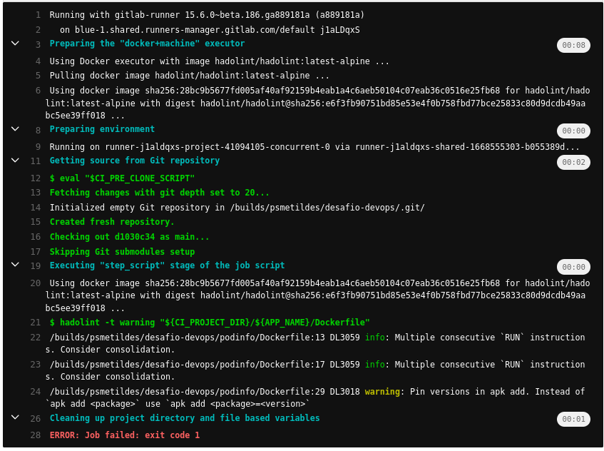
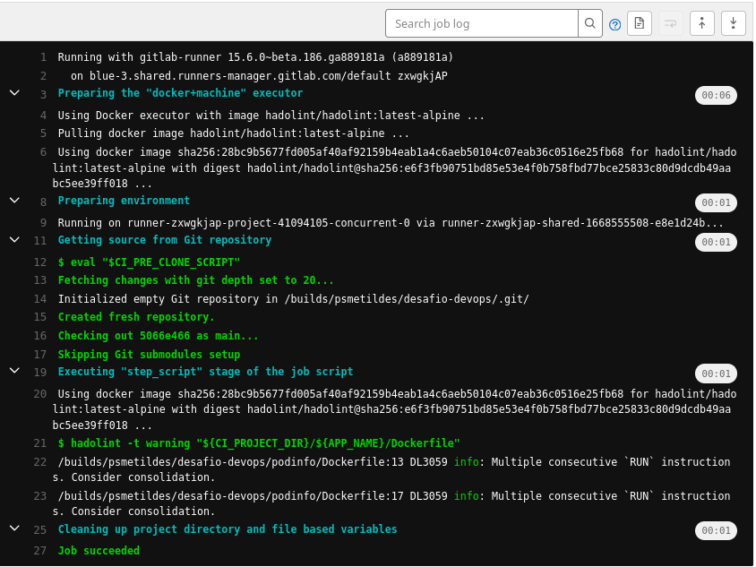
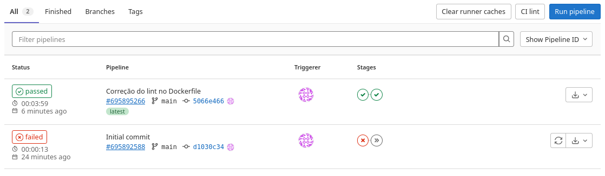

## 1. Gitlab

[.gitlab-ci.yml](resposta1/.gitlab-ci.yml)

## 2. Terraform

Foi criado um token no gitlab para o terraform.
```
export GITLAB_TOKEN="glpat-"
cd gilab 
terrform init
terraform plan -out plano
terraform apply plano 
```

Criando cluster kind
```
cd kind
terrform init
terraform plan -out plano
terraform apply plano 
```

## 3. Kubernetes

Modificado deploy para adicionar probes liveness, readiness. </br>
limite de resource de cpu e memória já existia. </br>
[deploy.yaml](resposta3/podinfo/deploy.yaml)

Utilizado o hpa, service monitor e promethues adapter para usar a metrica `requests_total` para escalar os pods quando observado mais de 2 req/seg.

helm install prometheus-adapter prometheus-community/prometheus-adapter -n monitoring --values values.yaml

[prometeus-adp-values](resposta3/prometeus-adp/values.yaml)

[servicemonitor.yaml](resposta3/podinfo/servicemonitor.yaml)

[hpa.yaml](resposta3/podinfo/hpa.yaml)


Instalação e configuração fluxcd

```
curl -s https://fluxcd.io/install.sh | sudo bash
source <(flux completion bash)

export GITLAB_TOKEN=<your-token>

flux bootstrap gitlab \
  --owner=psmetildes \
  --repository=fluxcd \
  --branch=main \
  --path=clusters/infra \
  --token-auth \
  --personal
```
Criado arquivos para avisar o fluxcd o repositório que ele deve monitorar.

[podinfo-source.yaml](resposta3/fluxcd/podinfo-source.yaml) </br>
[podinfo-kustomization.yaml](resposta3/fluxcd/podinfo-kustomization.yaml)

Feito o push dos arquivos para repositório do fluxcd

```
git clone git@gitlab.com:psmetildes/fluxcd.git

git add -A 
git commit -m "Add podinfo GitRepository"
git push

kubectl create -f podinfo-source.yaml
kubectl create -f podinfo-kustomization.yaml
```

Clonado o repositório desafio-devops e adicionado o diretório do podinfo.

```
git clone git@gitlab.com:psmetildes/desafio-devops.git
cd desafio-devops
mv podinfo/ desafio-devops
mv .gitlab-ci.yml desafio-devops

git config --global user.name "Paulo"
git config --global user.email "ps_metildes@....."

git init --initial-branch=main
git remote add origin git@gitlab.com:psmetildes/desafio-devops.git
git add .
git commit -m "Initial commit"
git push -u origin main

Criado token para pipiline usar o container registry e adiciona na variavel CI_GITLAB_TOKEN
```



Correção dockerfile

```
vim Dockerfile
ca-certificates=20220614-r0 curl=7.83.1-r4 netcat-openbsd=1.130-r3
```




## 4. Observabilidade

```
helm install prom  prometheus-community/kube-prometheus-stack --namespace monitoring --values values.yaml

helm install promtail grafana/promtail -n monitoring --values promtail.yaml

helm repo add grafana https://grafana.github.io/helm-charts

helm install loki grafana/loki-distributed -n monitoring

kubectl port-forward service/prom-kube-prometheus-stack-prometheus -n monitoring 9090:9090

kubectl port-forward service/prom-grafana -n monitoring 3000:80

```


Ficou faltando
```
  -> [plus] monitorar métricas do app `request_duration_seconds`
  -> alertar quando observar > 3 seg.
  -> enviar alertas para um canal no telegram
  -> [plus] tracing (Open Telemetry)
```