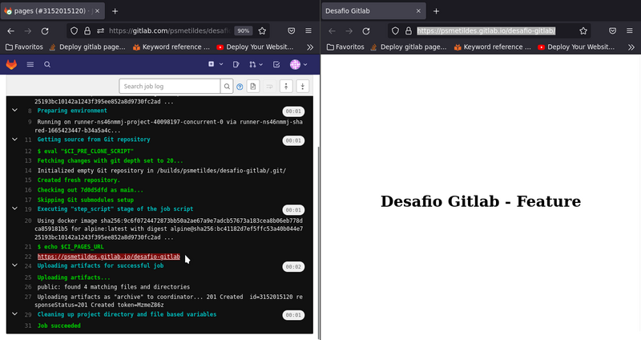

# Desafio GitLab

1. Crie uma conta no Gitlab: Gitlab.
``` 
Usado conta já existente.
``` 

2. Foi criado o repositório público chamado "desafio-gitlab" e clonado.

```
mkdir ~/formando_devops
cd ~/formando_devops
git clone git@gitlab.com:psmetildes/desafio-gitlab.git 
```

3. Os arquivos foram copiados para diretório clonado e feito o commit.

```
cd desafio-gitlab
cp -arv ~/Downloads/formando-devops/desafio-gitlab/* .
git add .
git commit -m "Adicionando arquivos do desafio no repositório"
```

4. Feito o push do repositório local para o repositório remoto.

```
git push -u origin main
```

5. Alterado o texto da página inicial para "Desafio GitLab - Dev".

```
vim public/index.html
git add public/index.html
git commit -m "Alteração no Texto da pagina inicial"
git push origin main
```

6. Criado uma nova branch chamada "feature" e alterado o texto da página inicial para "Desafio GitLab - Feature".
```
git checkout -b feature
sed -i 9s'/Dev/Feature/' public/index.html
git add public/index.html
git commit -m "Alteração no Texto da pagina inicial de Dev para Feature"
git push origin feature
```

7. Criado uma pipeline no GitLab CI para fazer o deploy do site estático no GitLab Pages. 

```
vim .gitlab-ci.yml
image: alpine:latest

pages:
  stage: deploy
  script:
  - echo $CI_PAGES_URL
  artifacts:
    paths:
    - public
  rules:
    - if: $CI_COMMIT_BRANCH == "feature" || $CI_COMMIT_BRANCH == $CI_DEFAULT_BRANCH
```

7.1 Enviado o arquivo .gitlab-ci.yml para o repositório remoto.

```
git add .gitlab-ci.yml
git commit -m "Adicionando arquivo .gitlab-ci.yml"
git push origin feature
```

8. Feito o merge da branch "feature" para a branch "main".
 


9. A variáel `$CI_PAGES_URL` utilizada no arquivo `.gitlab-ci.yml` retornou o link do Gitlab Pages.

```
https://psmetildes.gitlab.io/desafio-gitlab
```

10. Resultado do acesso ao link do GitLab Pages
[Link GitLab Pages](https://psmetildes.gitlab.io/desafio-gitlab)



11. [Link do repo GitLab](https://gitlab.com/psmetildes/desafio-gitlab)

12. Image Git Log


13. Imagem do Gitlab Pages criado


